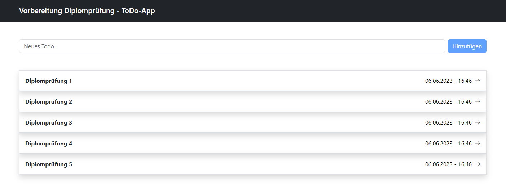
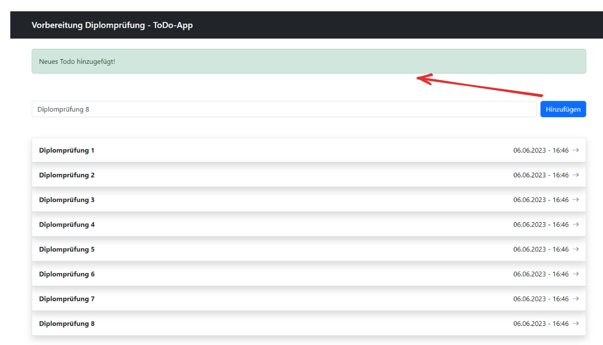
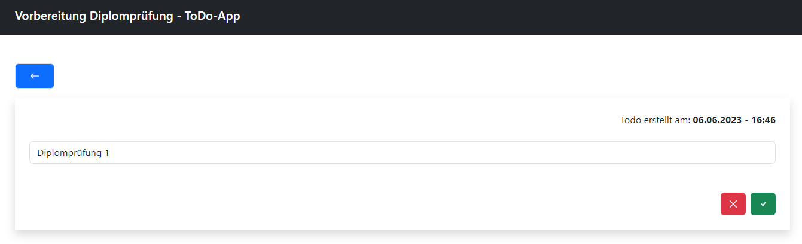

# Vorbereitung Diplomprüfung

## Vorbereitung und Einleitung:

Für diese Vorbereitung benötigst du Bootstrap 5. Entsprechende Anleitungen findest du hier: https://getbootstrap.com/docs/5.3/getting-started/introduction/

Versuche die Views und Components mit Bootstrap möglichst 1:1 nachzubilden. Für die Übung wird die ./01_ToDoApp im gleichen Verzeichnis verwendet.

### Auftrag 1.0 - View 'Todos.vue' erweitern

Erweitere die View ```src/components/Todos.vue``` damit alle Todos aus dem store angezeigt werden.

Baue die View anhand dieses Screenshots auf:



#### Anleitung

Die folgenden Komponenten müssen hierfür erweitert werden:

* ```src/components/CreateTodo.vue```

```javascript{cmd=node}
    const addTodo = () => {
      // erweitern
    }
```

```html
    <template>
        <form class="row g-2 pb-5">
           // erweitern
        </form>
    </template>
```

* ```src/components/ListTodos.vue```

```javascript{cmd=node}
    const todos = computed(() => {
      // erweitern
    })
```

```html
    <template>
        <router-link v-for="todo in todos" :key="todo.id" :to="`/${todo.id}`" class="text-decoration-none text-dark">
            // erweitern
        </router-link>
    </template>
```

### Auftrag 1.1 - Component 'Alert.vue' erstellen

Erstelle eine neue Komponente ```src/components/Alert.vue``` welche für 3 Sekunden angezeigt werden soll, sobald ein Todo hinzugefügt wurde.

Baue die Komponente anhand dieses Screenshots auf:



#### Anleitung

* Erstelle die Komponente ```src/components/Alert.vue``` mit dem folgenden Template

```html
    <template>
        <div v-if="state.show" class="alert alert-success mt-4" role="alert">
            {{  state.message }}
        </div>
    </template>
```

* Verwende im store folgende Methoden. Die entsprechende Logik sollte in der Komponente ```src/components/CreateTodo.vue``` umgesetzt werden

```javascript{cmd=node}
    showAlert(message) {
      this.alert.show = true;
      this.alert.message = message;

      setTimeout(() => {
        this.alert.show = false;
      }, 3000);
    },

    getAlert(state) {
      return state.alert
    }
```

* Im Vue-Router ```src/router/router.js``` muss ein neuer Eintrag hinzugefügt werden:

```javascript{cmd=node}
    const routes = [
    {
      path: '/',
      component: Todos,
      name: 'home',
    },
    {
    // erweitern
    }
  ]
```

* In der View ```src/components/Todos.vue``` muss die Komponente eingebunden werden:

```javascript{cmd=node}
    <template>
      <Alert/>
      <CreateTodo class="pt-5" />
      <ListTodos/>
  </template>
```

### Auftrag 1.2 - View 'Todo.vue' erstellen

Erstelle eine neue View ```src/views/Todo.vue``` um bereits vorhandende Todo Einträge zu bearbeiten oder zu löschen.

Baue die View anhand dieses Screenshots auf:



#### Anleitung

* Erstelle die View ```src/views/Todo.vue``` und die dazugehörige Komponente ```src/components/ShowTodo.vue``` mit mindestens den folgenden Methoden

```javascript{cmd=node}
    const updateTodo = () => {
      // erweitern
    }

    const removeTodo = () => {
      // erweitern
    }
```

* Verwende vom store folgende Methoden in der Komponente

```javascript{cmd=node}
    updateTodo(id, content) {
      const todoIndex = this._findTodoIndexById(id)

      this.todos[todoIndex].content = content
    },

    deleteTodo(id) {
      const todoIndex = this._findTodoIndexById(id)

      this.todos.splice(todoIndex, 1)
    },
```

* Nach bearbeiten oder löschen des Todo's wird man wieder auf die View ```Todos.vue``` umgeleitet.


### Hilfestellungen

Unter ../02_Uebungen/.. findest du weitere Beispiele und Unterlagem.


